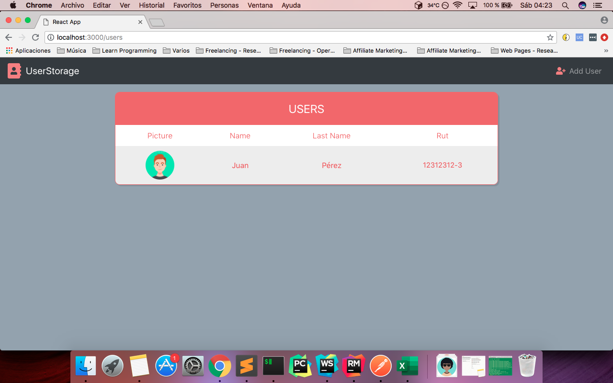
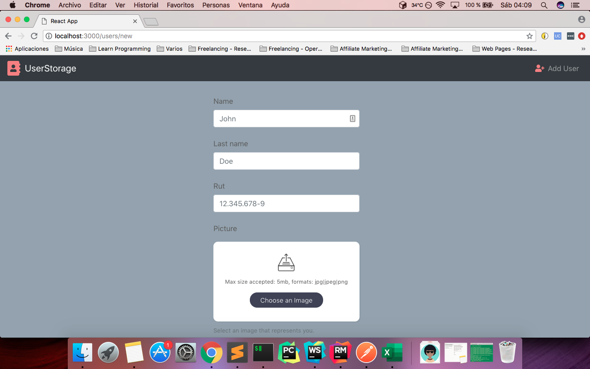
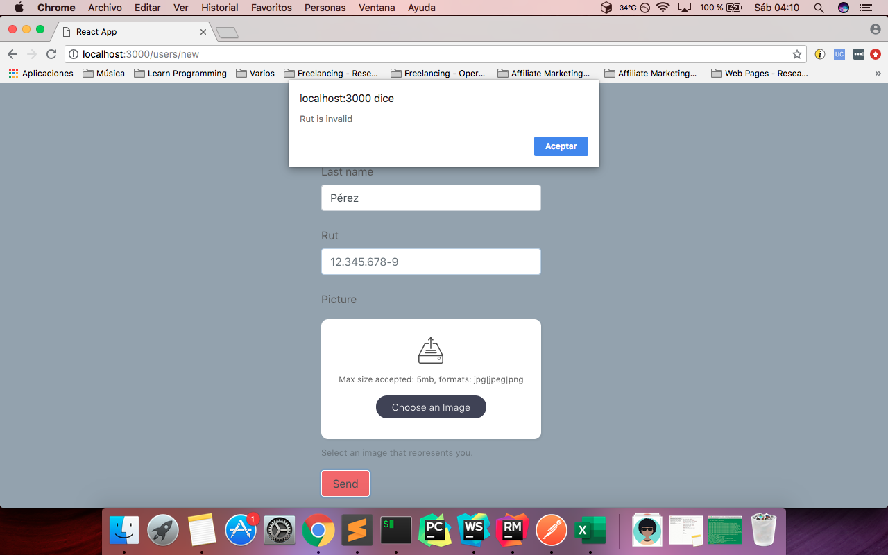
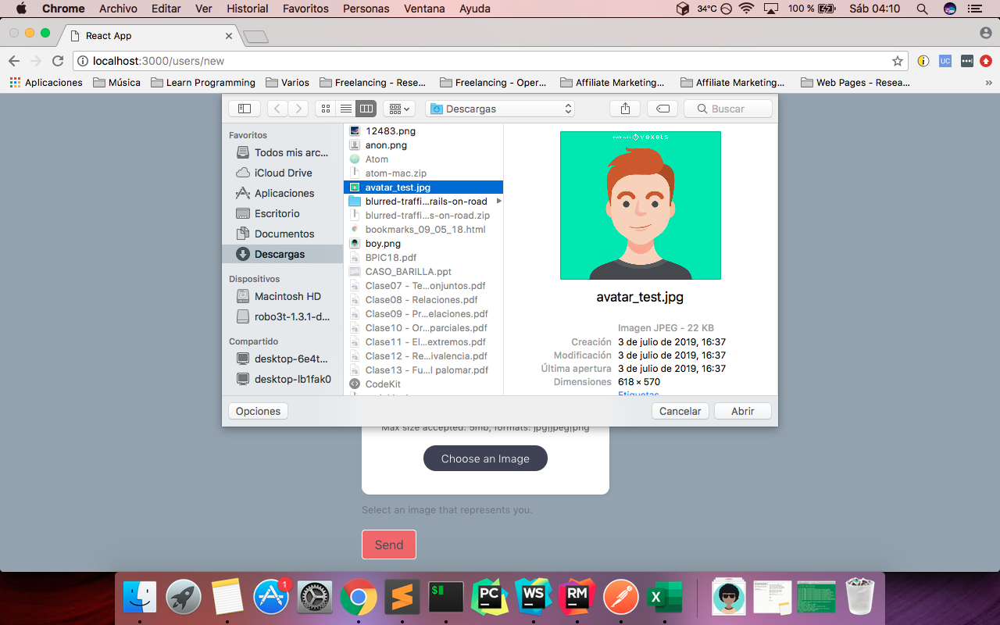
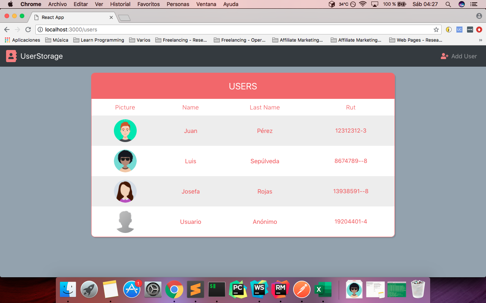
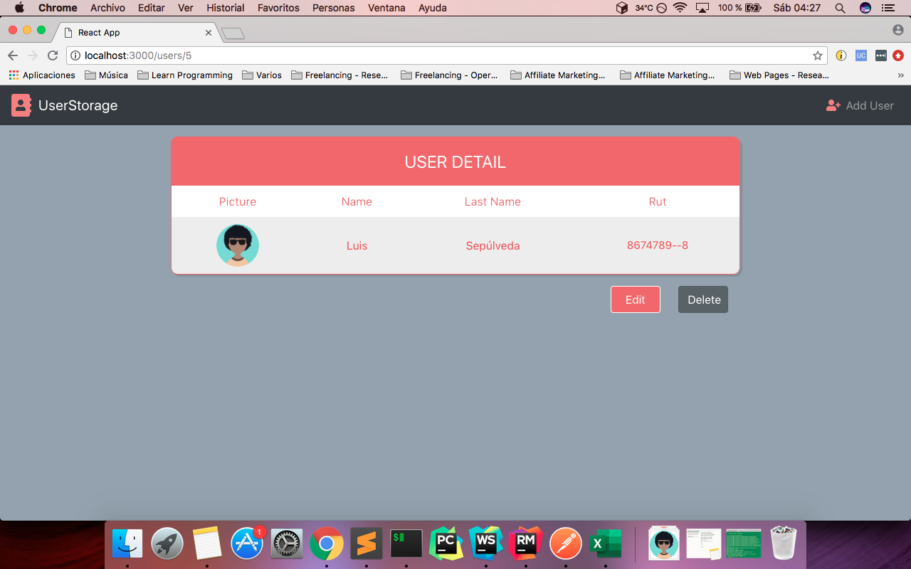
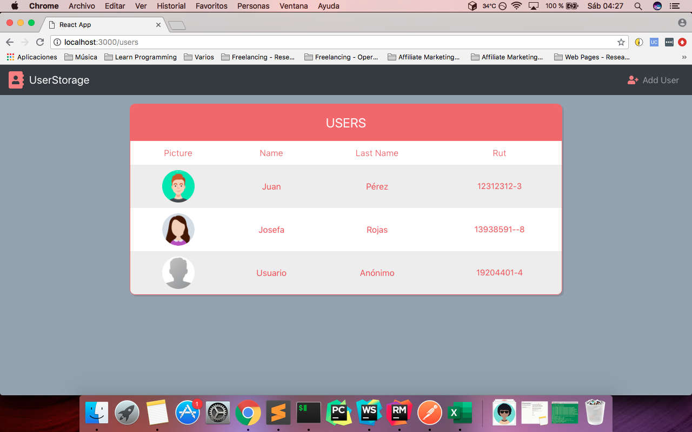

# UsersStorageFrontend
Collection of users accessed through React 16 and Bootstrap 4

##Description
User Crud made in React with the packages 'reactstrap' (Bootstrap), 'react-images-upload', 'react-router-dom' and 'axios'. The app itself was made with 'create-react-app'. I used sass  instead of css.

The app supports rut validation, the ability to choose your profile picture among three different formats (.jpg, .jpeg, .png) and it shows an anonymous avatar when the user does not select a picture.

## Installation
From the root folder of the project, run the command:

npm start

And go to http://localhost:3000

## Images

